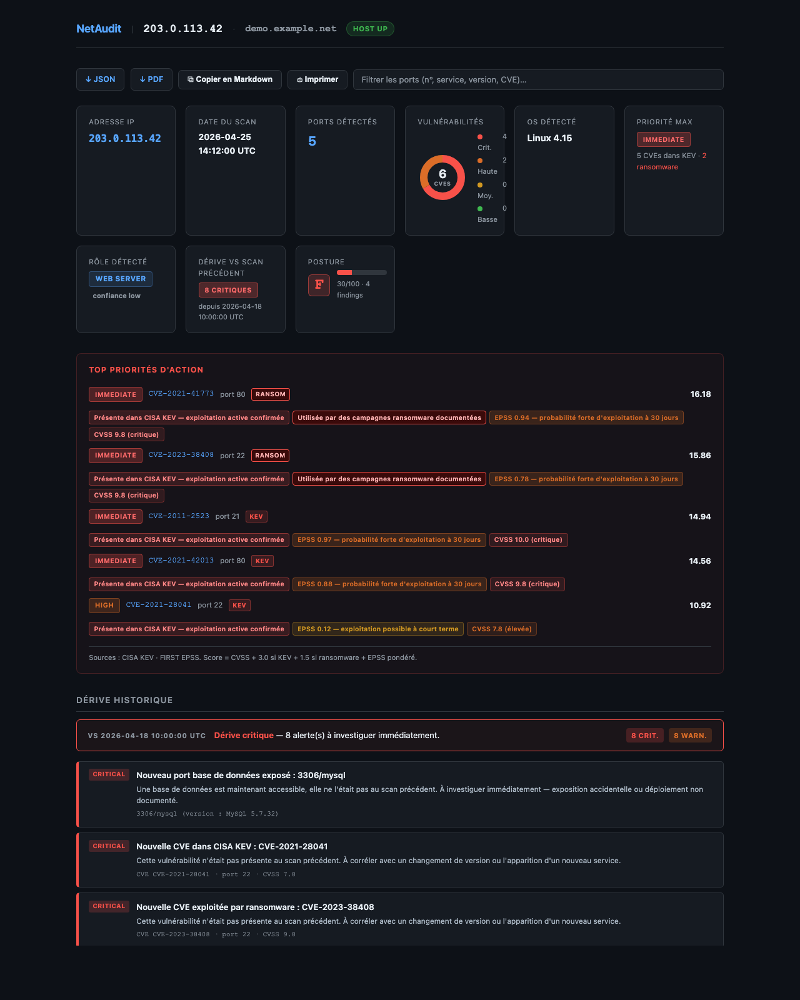

# NetAudit

[](https://github.com/KeizerSec/netaudit/actions/workflows/ci.yml)


**Scanner réseau qui ne se contente pas de remonter des CVEs — il les hiérarchise par exploitation réelle.**
Croise CVSS, CISA KEV, FIRST EPSS et campagnes ransomware pour dire *quoi patcher en premier* et *pourquoi*.



> **Usage légal uniquement.** Ne scannez que des hôtes sur lesquels vous avez une autorisation explicite.

---

## Démo en 60 secondes

```bash
git clone https://github.com/KeizerSec/netaudit && cd netaudit
docker build -t netaudit .
docker run -p 5000:5000 netaudit

# Dans un autre terminal
curl http://localhost:5000/scan/192.168.1.1
open  http://localhost:5000/rapport/192.168.1.1
```

Trois formats en sortie : **HTML** interactif, **JSON** pour les pipelines, **PDF A4** pour l'audit.

---

## Ce qui distingue NetAudit

| Couche | Ce que NetAudit fait | Source |
|---|---|---|
| **Priorisation exploitée** | Score combiné CVSS + KEV + ransomware + EPSS, niveau IMMEDIATE/HIGH/… et **raisons explicables par CVE** | CISA KEV · FIRST EPSS |
| **Corrélation ATT&CK** | CVE → CWE → techniques, chemin d'attaque par kill chain, mitigations | Catalogue local (79 techniques, 47 services) |
| **Détection contextuelle** | Classification automatique du rôle + 12 règles anti-pattern, score de posture 0–100 | 100 % local, déterministe |
| **Baseline historique** | Diff vs scan précédent, alertes critical/warning/positive, escalade KEV | SQLite local |
| **Exports** | HTML dark-mode, JSON brut, PDF A4 (reportlab), Markdown presse-papier | — |

Le tout **offline-safe** : un échec réseau dégrade sur cache ou CVSS seul, jamais d'exception à la surface.

---

## Endpoints API

| Méthode | Endpoint | Description | Auth |
|---|---|---|---|
| GET | `/scan/<ip>` | Lance un scan | oui (5/min) |
| GET | `/rapport/<ip>` | HTML — `?format=json\|pdf` | oui |
| GET | `/history` · `/history/<ip>` | Historique persistant | oui |
| GET | `/version` · `/health` | Métadonnées build / probe | non |

Auth par header `X-API-Key` (comparaison à temps constant). Rate limit Flask-Limiter. Path-traversal checké sur `/rapport/<ip>`.

---

## Configuration

```bash
cp .env.example .env   # ajuster ensuite
```

| Variable | Défaut | Rôle |
|---|---|---|
| `API_KEY` | *(vide)* | Auth ; vide = mode dev sans auth |
| `NMAP_TIMEOUT` | `300` | Timeout Nmap (secondes) |
| `CACHE_DIR` | `./cache` | Cache KEV/EPSS, TTL 24 h |
| `HISTORY_DB_PATH` | `./netaudit.db` | SQLite historique |
| `PRIORITIZER_ENABLED` | `1` | `0` = offline strict (CVSS seul) |
| `BUILD_COMMIT` | *(vide)* | Hash injecté au build, exposé par `/version` |

Toutes les variables sont listées dans `.env.example`.

---

## Comment le score de priorité est calculé

```
priority = CVSS
         + 3.0  si CVE présente dans CISA KEV  (exploitation avérée)
         + 1.5  si KEV flag ransomware          (impact opérationnel élevé)
         + 2.0 × EPSS  si EPSS ≥ 0.5            (probabilité forte)
         + 1.0 × EPSS  si EPSS < 0.5

Niveaux :  IMMEDIATE ≥ 13   HIGH ≥ 10   MEDIUM ≥ 6   LOW ≥ 3   INFO
```

**Chaque CVE affiche *pourquoi* son niveau a été attribué** (`priority_reasons`) — pas de boîte noire. Exemple :

- `CISA KEV — exploitation active confirmée`
- `Campagnes ransomware documentées`
- `EPSS 0.88 — probabilité forte d'exploitation à 30 jours`
- `CVSS 9.8 (critique)`

Les coefficients sont volontairement simples et explicables. Ils traduisent une règle métier : *une CVSS 7 activement exploitée doit sortir au-dessus d'une CVSS 9 inutilisée dans la nature*. Voir `src/prioritizer.py` pour les choix d'implémentation.

---

## Tests & CI

```bash
pip install -r requirements.txt
PRIORITIZER_ENABLED=0 pytest tests/ -q
```

**335 tests**, hermétiques (aucun appel réseau), exécution < 1 s. CI GitHub Actions sur Python 3.11 + 3.12, `docker build` validé à chaque push.

---

## Structure

```
netaudit/
├── src/
│   ├── scan.py              Moteur Nmap + parser XML + orchestration
│   ├── webapp.py            API REST Flask
│   ├── prioritizer.py       Score CVSS + KEV + EPSS, raisons explicables
│   ├── attack_mapper.py     Corrélation MITRE ATT&CK
│   ├── profiler.py          Classification rôle + 12 règles de posture
│   ├── baseline.py          Diff vs scan précédent
│   ├── history.py           Persistance SQLite
│   ├── exports.py           JSON + PDF (reportlab)
│   └── data/                Catalogues ATT&CK + CWE + services + CVEs
├── scripts/
│   ├── refresh_known_cves.py  Sync KEV → known_cves.json
│   └── render_demo.py         Rend un rapport de démonstration
├── tests/                  335 tests unitaires + d'intégration
├── docs/img/               Captures d'écran, rapport de démo
├── Dockerfile              Image slim Python 3.11 + Nmap, HEALTHCHECK
└── requirements.txt        Versions fixées
```

---

## Limitations

- Outil d'audit rapide et d'apprentissage — **pas** un remplaçant de Nessus / OpenVAS.
- La corrélation ATT&CK est heuristique ; elle donne des pistes, pas des certitudes.
- La priorisation EPSS+KEV dépend d'un accès réseau à CISA/FIRST. En mode `PRIORITIZER_ENABLED=0`, seul le CVSS est utilisé.
- Cache Nmap `lru_cache` **in-process** — deux workers Gunicorn ne partagent pas leur cache. Acceptable en single-host, à migrer vers Redis pour un scale horizontal.

Pour le détail des changements : voir [`CHANGELOG.md`](CHANGELOG.md).
Pour signaler une vulnérabilité : voir [`SECURITY.md`](SECURITY.md).

---

## Licence

MIT — voir `LICENSE`.
